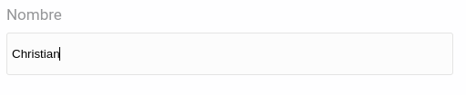
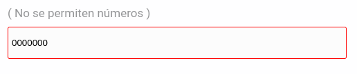
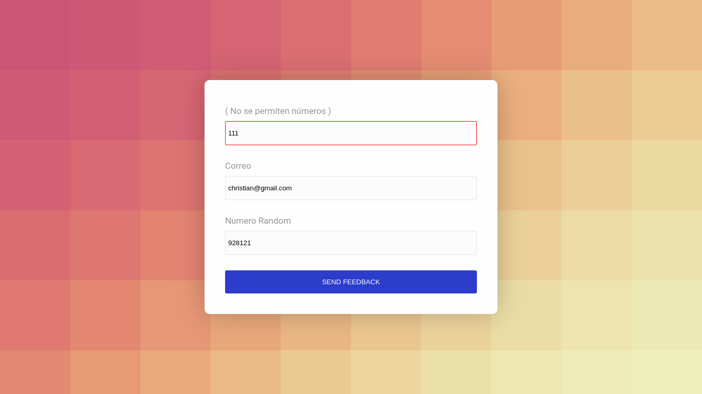

# **Empresa Buho** 
## **Caso-1**: Formulario
[Ver demo ->](https://chapst1.github.io/buho-form/)

## **Funciones:**

## "Todos los campos deben estar llenos":

## "No numeros en el campo de Nombre":

## "Numero random al recargar la pagina":

## "Alerta de Confirmación":
