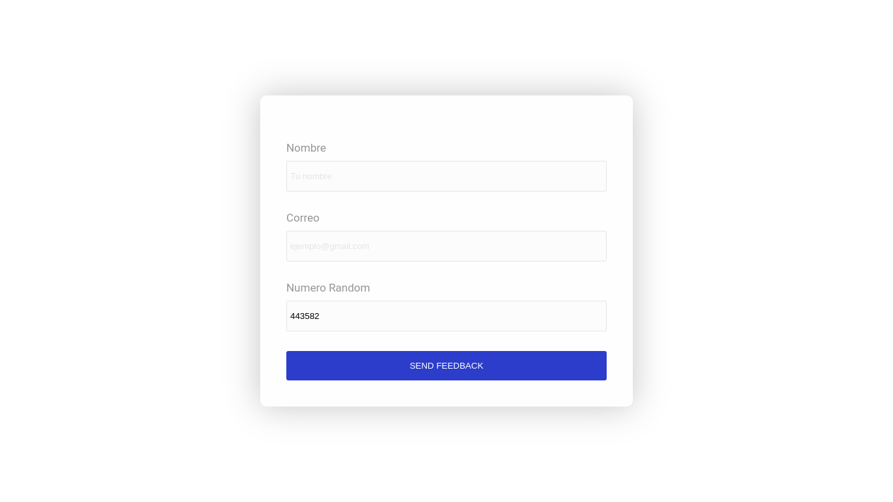
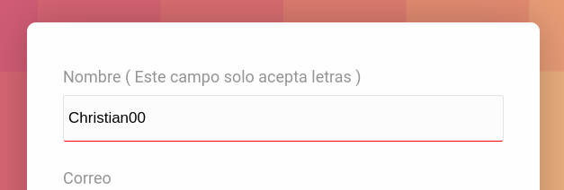
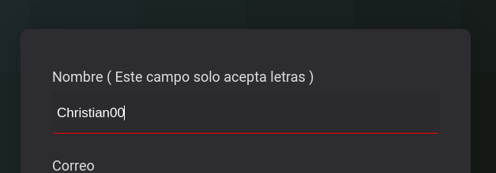
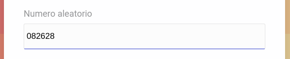
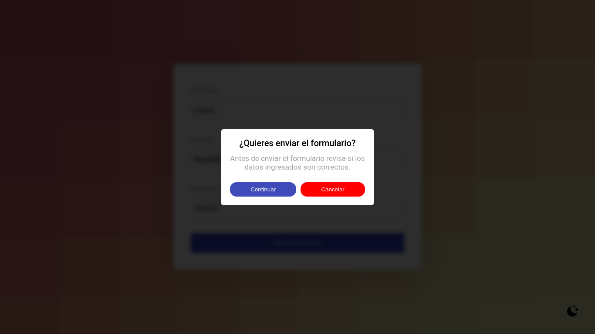

# **Empresa Buho** 
## **Caso-1**: Formulario
[Ver demo ->](https://chapst1.github.io/buho-form/)

## **Funciones:**

## *"Todos los campos deben estar llenos"*:

## *"No se permiten numeros en el campo de nombre"*:

## *"Numero aleatorio al recargar la pagina"*:

## *"Alerta de confirmacion"*:

## *"Dark & Light Mode"*:

## *"Diseño Adaptable a dispositivos moviles"*:

